<div align="center">

[](https://git.io/typing-svg)
 
🎓 BCA Student &nbsp;•&nbsp; 📍 India &nbsp;•&nbsp; 🗣️ EN · HI · KN
 
[](https://pavana05.framer.ai/)
[](https://github.com/pavana05)
[](https://www.linkedin.com/in/pavana-25t/)
[](https://www.instagram.com/_pavan_05._/)
[](https://g.dev/pavan05)
[](https://www.skills.google/public_profiles/85afb518-7597-4a6c-a259-677a02ddf29e)
[](https://api.whatsapp.com/send/?phone=9036048950&text=Hello+pavan+%F0%9F%91%8B&type=phone_number&app_absent=0)
[](mailto:pavana25t@gmail.com)
 


 
<sub>ABOUT · TECH STACK · STATS · PROJECTS · CONTACT</sub>
 
</div>
---
 
## 🧑‍💻 `about_me.py`
 
```python
class Pavan:
    def __init__(self):
        self.role = "Student · Full-Stack Developer · Cloud & Data Enthusiast"
        self.focus = "Designing and building fast, scalable web experiences"
        self.loves = ["clean UI/UX", "solving real-world problems", "open source"]
        self.also_into = ["cloud computing", "data analytics", "dashboards that tell a story"]
        self.currently_learning = "something new, every single week"
        self.communities = ["GDG", "Google Cloud Arcade"]
 
    def philosophy(self):
        return "Good design is invisible — until it's missing."
 
    def say_hi(self):
        return "Let's build something people actually enjoy using."
```
 
*Building things I'd want to use myself.*
 
---
 
## 🎯 `current_focus.md`
 
- 🚀 Shipping polished, production-ready web apps end-to-end
- 🎨 Obsessing over micro-interactions and motion that make UI feel alive
- 🧠 Leveling up in system design and scalable architecture
- 🤖 Exploring how AI-assisted tools can speed up great engineering, not replace it
- 🌍 Growing through GDG and other developer communities
---
 
## 🧭 `journey.log`
 
`2023` Wrote my first "Hello World" and got hooked
`2024` Started building real projects, discovered the joy of good UI
`2025` Went deep on system design — shipped things, broke things, learned why
`Now` Building fast, polished products — and always up for the next hard problem
 
**2026 goals →** ship 3 polished side-projects · contribute to 5 open-source repos · speak at a local dev meetup
 
---
 
## 🎓 `education.log`
 
| Qualification | Institution | Years |
|---|---|---|
| **Bachelor of Computer Applications (BCA)** | Hoysala Degree College | 2023 – 2026 |
| CEBA (PU) | Hoysala PU College | 2021 – 2023 |
| SSLC | Ebenezer St Thomas School | 2020 |
 
---
 
## 🛠️ `tech_stack.sh`
 
<div align="center">
**🌐 Languages**
 

**🎨 Frontend & Backend**
 

**💾 Databases & Cloud**
 

**📈 Data Analytics**
 


 
**🧰 Tools**
 

</div>
---
 
## ⚡ `core_skills.json`
 


 
---
 
## 📊 `github_stats.json`
 
<div align="center">


</div>
> Stats & top-languages are self-hosted (see the setup note at the very top of this file) so they're immune to the public server's rate limits. Streak / activity graph / trophy still pull live from their own shared servers — usually stable, but tell me if any of those go blank too and I'll move them to the same self-hosted setup.
 
---
 
## 🌐 `developer_network.md`
 
<div align="center">
[](https://g.dev/pavan05)
[](https://www.skills.google/public_profiles/85afb518-7597-4a6c-a259-677a02ddf29e)
 
</div>
---
 
## 🏅 `achievements.log`
 
<div align="center">


 
</div>
> Got a Holopin board too? There's a slot for it in **Level Up** below.
 
---
 
## 🚀 `featured_projects/`
 
| Project | Description | Tech | Links |
|---|---|---|---|
| **Official College Website** | Built with a 3-member team for Hoysala Degree College. | `CSS` `TypeScript` `Supabase` | [Demo](#) · [GitHub](#) |
| **Portfolio Website** | Fully responsive personal portfolio showcasing my work. | `React.js` | [Demo](https://pavana05.framer.ai/) · [GitHub](#) |
| **Data Analysis Project** | Processed mall customer records into strategic business insights. | `Python` `SQL` `Excel` `Power BI` | [Demo](#) · [GitHub](#) |
| **Microbes Prediction Project** | ML prediction system built on a Random Forest model. | `Python` `HTML` | [Demo](#) · [GitHub](#) |
 
> Add your repo links above (Demo/GitHub) whenever you have them handy — the descriptions and tech are already pulled straight from your resume.
 
---
 
## 💬 `quote_of_the_day`
 
<div align="center">
[](https://github.com/piyushsuthar/github-readme-quotes)
 
</div>
---
 
## 🎲 `fun_facts.txt`
 
<details>
<summary>Click to reveal</summary>
<br>
- 🌙 Dark mode isn't a preference, it's a personality trait
- ⏱️ Can spend an hour tuning a 200ms animation curve until it feels "right"
- ☕ Believes the best ideas show up mid-debugging, never during planning
- 🧩 Has more side-project ideas than hours in the week
- 🔁 `git commit -m "fix"` shows up in the log more often than it should
</details>
```python
# bugs are just undocumented features in disguise
try:
    ship_it()
except Bug as oops:
    laugh(); fix(oops); ship_it()
```
 
---
 
## 📫 `lets_connect.md`
 
I'm always up for talking product, design, or a good technical rabbit hole — reach out, I read everything.
 
<div align="center">
[](https://pavana05.framer.ai/)
[](mailto:pavana25t@gmail.com)
[](https://www.linkedin.com/in/pavana-25t/)
[](https://api.whatsapp.com/send/?phone=9036048950&text=Hello+pavan+%F0%9F%91%8B&type=phone_number&app_absent=0)
[](./resume.pdf)
 
</div>
---
 
<details>
<summary><b>🔧 Level Up — optional extras (a few minutes of setup, then they run themselves)</b></summary>
<br>
These depend on either a file you upload or an account you may not have yet, so they're kept out of the main view until you're ready for them.
 
**1 · Contribution snake**
Add the included `snake.yml` to `.github/workflows/` in this repo, then run it once from the **Actions** tab (this is the same workflow that already powers the self-hosted stats cards above).
 
```html
<picture>
  <source media="(prefers-color-scheme: dark)" srcset="https://raw.githubusercontent.com/pavana05/pavana05/output/github-contribution-grid-snake-dark.svg" />
  <source media="(prefers-color-scheme: light)" srcset="https://raw.githubusercontent.com/pavana05/pavana05/output/github-contribution-grid-snake.svg" />
  
</picture>
```
 
**2 · Custom hero illustration**
Upload the included `hero-illustration.svg` to this repo's root, then drop this line in wherever you'd like it (e.g. under the wave banner):
 
```html

```
 
**3 · Holopin badge board**
Create a free account at [holopin.io](https://holopin.io), then add:
 
```html
[](https://holopin.io/@pavana05)
```
 
</details>
---
 
<div align="center">

 


**Thanks for stopping by — go build something. ✨**
 
</div>
<!--
PRIVATE NOTE (visible only in raw markdown, not on the rendered page):
Check this repo's Insights → Traffic tab for private visitor stats — daily views, referrers, countries. Visitors never see this panel, only you can.
-->
